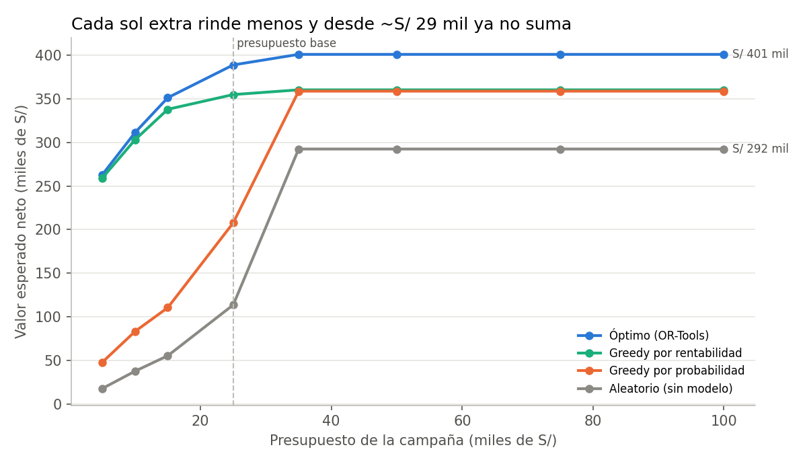
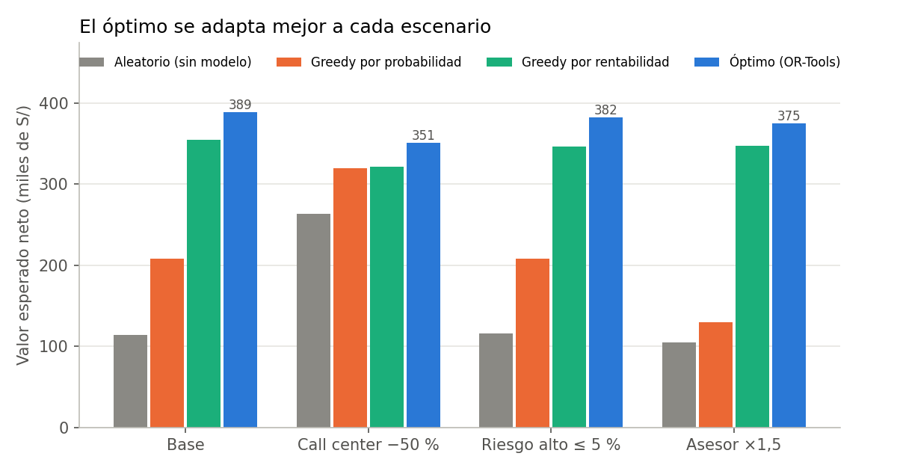
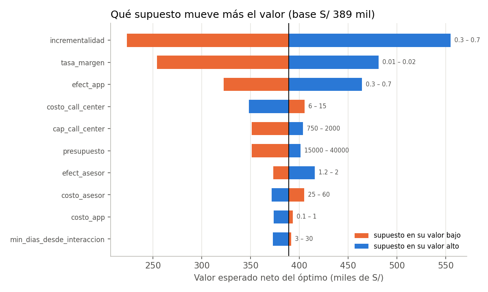

# Optimización de contactos

Modelo: `ens_3`. Evaluación en el mes **t=10** (último de validación, no es la caja fuerte t=11); probabilidades calibradas con **isotonica** usando solo t=[8, 9]. Supuestos detallados y su porqué: [`supuestos_opt.md`](supuestos_opt.md).

Supuestos centrales: presupuesto S/ 25,000; canales app (S/ 0.3, x0.5, cupo sin tope), call_center (S/ 9.0, x1.0, cupo 1500), asesor (S/ 35.0, x1.5, cupo 400); valor = clip(1.5% × ingresos, 100, 1500) × (1 − pérdida) × 50% incremental; riesgo alto ≤ 10%; sin contacto si interactuó hace < 7 días; asesor solo a ≤ 10 km.

## 1. Formulación

Maximizar Σ x[i,c]·(p_i · efectividad_c · valor_i − costo_c), con x binaria (SCIP, brecha ≤ 0,1 %) y las restricciones C1 (un contacto por cliente), C2 (cupos de call center y asesor), C3 (presupuesto), C4 (app solo con `activo_movil`; asesor solo a ≤ 10 km), C5 (riesgo alto ≤ 10 % de los contactados), C6 (no contactar si interactuó hace < 7 días) y C7 (solo EV > 0).

## 2. Las estrategias con el mismo presupuesto

| Estrategia | Contactados | Costo | Valor esperado neto | Valor con conversiones observadas* | Conversiones observadas | Riesgo alto | App / Call / Asesor |
|---|---|---|---|---|---|---|---|
| Aleatorio (sin modelo) | 1 686 | S/ 25 000 | **S/ 113 693** | S/ 124 506 | 277 | 9.9% | 66 / 1 220 / 400 |
| Greedy por probabilidad | 1 628 | S/ 25 000 | **S/ 207 768** | S/ 245 843 | 471 | 2.3% | 6 / 1 222 / 400 |
| Greedy por rentabilidad | 7 443 | S/ 24 999 | **S/ 354 867** | S/ 401 035 | 1 334 | 9.9% | 5 663 / 1 500 / 280 |
| Óptimo (OR-Tools) | 7 020 | S/ 24 967 | **S/ 388 855** | S/ 447 275 | 1 275 | 10.0% | 5 238 / 1 499 / 283 |

*Backtest aproximado: y · efectividad · valor − costo con las conversiones que sí ocurrieron ese mes. No es causal (ese mes no hubo esta campaña), pero no depende de la calibración.

- **Valor del modelo** (greedy por probabilidad − aleatorio): **S/ 94 075** por campaña (S/ 121 337 con conversiones observadas).
- **Valor de la optimización** (óptimo − greedy por probabilidad): **S/ 181 087** por campaña (S/ 201 432 observado).
- Prueba honesta: contra un greedy bien hecho (ordena por valor/costo), el óptimo agrega S/ 33 988 (9.6%). La mayor parte del valor viene de **usar el canal correcto** (mucha app barata para la propensión media, asesor solo para el valor alto), no del solver en sí.

Asignación para el test (diciembre): **6 700** clientes (app 4 914, call center 1 500, asesor 286), valor esperado S/ 389 334. Archivo: `outputs/asignacion.csv`.

## 3. Curva presupuesto → valor

| Presupuesto | Aleatorio | Greedy prob. | Greedy rentab. | Óptimo | Valor marginal del óptimo por S/ 1.000 |
|---|---|---|---|---|---|
| S/ 5 000 | S/ 17 825 | S/ 47 960 | S/ 259 284 | **S/ 263 049** | — |
| S/ 10 000 | S/ 37 718 | S/ 83 272 | S/ 303 086 | **S/ 311 329** | S/ 9 656 |
| S/ 15 000 | S/ 55 414 | S/ 110 563 | S/ 337 992 | **S/ 351 277** | S/ 7 990 |
| S/ 25 000 | S/ 113 693 | S/ 207 768 | S/ 354 867 | **S/ 388 855** | S/ 3 758 |
| S/ 35 000 | S/ 292 440 | S/ 358 809 | S/ 360 296 | **S/ 400 981** | S/ 1 213 |
| S/ 50 000 | S/ 292 440 | S/ 358 809 | S/ 360 296 | **S/ 400 981** | S/ 0 |
| S/ 75 000 | S/ 292 440 | S/ 358 809 | S/ 360 296 | **S/ 400 981** | S/ 0 |
| S/ 100 000 | S/ 292 440 | S/ 358 809 | S/ 360 296 | **S/ 400 981** | S/ 0 |

## 4. Escenarios

| Escenario | Óptimo | Δ vs base | Greedy prob. | Greedy rentab. | Contactados (óptimo) | App / Call / Asesor |
|---|---|---|---|---|---|---|
| base | **S/ 388 855** | S/ 0 | S/ 207 768 | S/ 354 867 | 7 020 | 5 238 / 1 499 / 283 |
| call_center_-50% | **S/ 351 023** | S/ -37 832 | S/ 319 888 | S/ 321 694 | 6 453 | 5 303 / 750 / 400 |
| riesgo_alto_5% | **S/ 381 932** | S/ -6 923 | S/ 207 768 | S/ 346 245 | 6 665 | 4 880 / 1 499 / 286 |
| costo_asesor_x1.5 | **S/ 375 141** | S/ -13 714 | S/ 129 656 | S/ 346 696 | 6 962 | 5 274 / 1 499 / 189 |

## 5. Tornado de supuestos (LP relajado)

| Supuesto | Rango | Valor (bajo) | Valor (alto) | Amplitud |
|---|---|---|---|---|
| incrementalidad | 0.3 – 0.7 | S/ 223 481 | S/ 554 789 | S/ 331 308 |
| tasa_margen | 0.01 – 0.02 | S/ 254 150 | S/ 481 074 | S/ 226 924 |
| efect_app | 0.3 – 0.7 | S/ 322 445 | S/ 463 904 | S/ 141 459 |
| costo_call_center | 6 – 15 | S/ 405 485 | S/ 348 492 | S/ 56 993 |
| cap_call_center | 750 – 2000 | S/ 351 029 | S/ 403 688 | S/ 52 659 |
| presupuesto | 15000 – 40000 | S/ 351 318 | S/ 400 985 | S/ 49 667 |
| efect_asesor | 1.2 – 2 | S/ 373 095 | S/ 415 873 | S/ 42 778 |
| costo_asesor | 25 – 60 | S/ 404 719 | S/ 371 573 | S/ 33 146 |
| costo_app | 0.1 – 1 | S/ 393 363 | S/ 373 615 | S/ 19 748 |
| min_dias_desde_interaccion | 3 – 30 | S/ 391 454 | S/ 372 796 | S/ 18 658 |
| max_share_riesgo_alto | 0.05 – 0.2 | S/ 382 184 | S/ 396 757 | S/ 14 573 |
| cap_asesor | 200 – 600 | S/ 379 800 | S/ 389 135 | S/ 9 335 |
| perdida_high | 0.1 – 0.25 | S/ 390 409 | S/ 386 702 | S/ 3 707 |

## 6. Precios sombra

Valor marginal de relajar cada restricción. *Dual LP*: dual del LP relajado (GLOP); *dif. finita*: se vuelve a resolver con un delta (+100 cupos de call center, +50 de asesor, +S/ 1.000, +1 p.p. de riesgo alto) y se divide.

| Restricción | Unidad | Dual LP | Dif. finita LP | Dif. finita MIP |
|---|---|---|---|---|
| cupo_call_center | S/ por cupo | 32.85 | 32.11 | 32.73 |
| cupo_asesor | S/ por cupo | -0.00 | 0.00 | 0.00 |
| presupuesto | S/ por S/ 1.000 | 3,080.39 | 3,037.44 | 2,941.85 |
| riesgo_alto | S/ por +1 p.p. | — | 1,084.83 | 1,146.79 |

La relajación LP queda a < 0,1 % del óptimo entero, por eso sus duales son una buena lectura del precio sombra. La diferencia finita MIP lleva el ruido de la brecha del solver (≤ 0,1 %).

## 7. Robustez

| Calibración | Brier | Log loss | ECE | p mín–máx | EV óptimo | EV greedy | Valor observado óptimo | Valor observado greedy |
|---|---|---|---|---|---|---|---|---|
| isotonica | 0.1273 | 0.4177 | 0.0154 | 0.000–1.000 | S/ 388 855 | S/ 207 768 | S/ 447 275 | S/ 245 843 |
| platt | 0.1273 | 0.4169 | 0.0196 | 0.012–0.638 | S/ 384 831 | S/ 202 871 | S/ 444 284 | S/ 244 146 |

- Coincidencia de los clientes elegidos por el óptimo con isotónica y con Platt (Jaccard): **95%**.
- Aleatorio con 20 semillas: EV S/ 111 676 ± S/ 1 801; observado S/ 124 754 ± S/ 6 388. El óptimo y los greedy no dependen de la semilla.

## 8. ¿Qué significa para el banco?

Cifras del mes de validación t=10 (octubre), con el modelo `ens_3` y los supuestos centrales de
[`supuestos_opt.md`](supuestos_opt.md). Todas salen de `reports/optimizacion_estrategias.csv` y
de los `reports/sens_*.csv`.

1. **Con los mismos S/ 25 000, el óptimo rinde 3,4 veces lo que rinde contactar al azar:**
   S/ 389 mil de valor esperado neto contra S/ 114 mil (S/ 112 mil ± 2 mil en 20 semillas).
   Con las conversiones que sí ocurrieron ese mes, los contactados por el óptimo convirtieron
   **1 275 veces contra 277**: el costo por venta baja de **~S/ 90 a ~S/ 20**.
2. **El modelo vale ~S/ 94 mil por campaña** (greedy por probabilidad − aleatorio) y **la
   optimización suma ~S/ 181 mil más** (óptimo − greedy por probabilidad). Siendo honestos:
   frente a un analista que ya ordena por rentabilidad (valor/costo), el solver agrega
   S/ 34 mil (+9,6 %). El gran salto es **elegir el canal correcto**: app barata para la
   propensión media (5 238 clientes), call center al tope (1 499) y asesor solo para alto
   valor (283 de 400 cupos).
3. **Precios sombra (dónde poner el próximo sol):**
   - **S/ 1 000 más de presupuesto ≈ S/ 2 900 a 3 000 más de valor**, pero solo hasta
     ~S/ 29 000. Desde ahí el valor se congela en S/ 401 mil: ya se contactó a todo cliente
     con valor esperado positivo y el límite pasa a ser la capacidad.
   - **Un cupo más de call center vale ~S/ 33** netos (32,1 a 32,9 según el método): más
     agentes en campaña conviene mientras cuesten menos que eso por contacto adicional.
   - **Un punto porcentual más de apetito de riesgo alto vale ~S/ 1 100**: la política de
     riesgo cuesta poco, y la recomendación es **no relajarla**.
   - **Un cupo más de asesor vale S/ 0**: hoy sobran 117 cupos de asesor. Esas horas se
     pueden usar en otra campaña.
4. **Escenarios:** si el call center pierde la mitad de sus cupos, el valor cae 10 %
   (S/ 389 mil → S/ 351 mil) y el óptimo lo compensa con más app. Endurecer el riesgo alto de
   10 % a 5 % cuesta solo 1,8 % (S/ 7 mil). Un asesor 50 % más caro cuesta 3,5 % (S/ 14 mil).
   En los cuatro escenarios el óptimo le gana a los otros tres métodos. (Con menos cupos de call
   center el aleatorio y el greedy por probabilidad *suben*: al no poder gastar en llamadas,
   gastan en app. Confirma que su problema es el canal, no el orden.)
5. **Lo que más mueve el resultado no es un costo sino la incrementalidad** (qué parte de la
   venta se debe al contacto). Entre 30 % y 70 %, el valor va de S/ 223 mil a S/ 555 mil. Le
   siguen el margen por producto (S/ 254 a 481 mil) y la efectividad de la app (S/ 322 a 464 mil).
   La decisión de **a quién** contactar es estable; lo incierto es **cuánto** vale. Por eso
   proponemos un **piloto A/B** con 10 % de control en la primera campaña.
6. **No depende de una calibración frágil:** isotónica y Platt dan el mismo Brier (0,1273), un
   valor que difiere en 1 % y **95 % de los mismos clientes elegidos**.

**Proyección anual (estimación, con los supuestos centrales):** ~S/ 389 mil × 12 ≈ **S/ 4,7
millones** de valor esperado neto, de los cuales ~S/ 3,3 millones (S/ 275 mil × 12) son
incrementales frente a contactar al azar. Es una cifra de orden de magnitud, no un compromiso:
se valida con el piloto.
